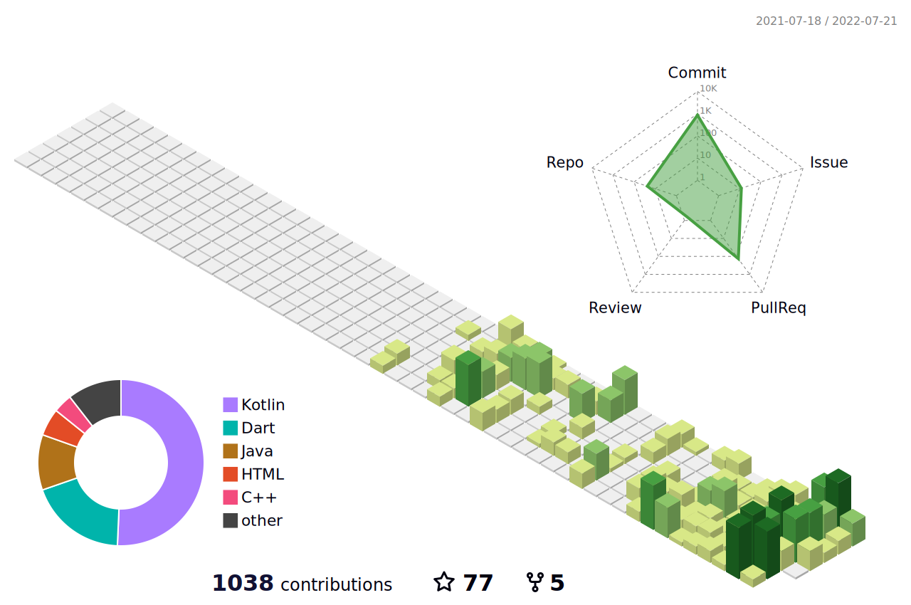

# Hi there👋, I am I am Eleo (a.k.a. EleoXDA and Elbay Malik)
  
---
## :information_desk_person:  About Me  :information_desk_person:
#### I am a mobile developer (kotlin, flutter,...swift). My journey started on XDA Developers Forum in 2012. I am advanced in QA and Junior in Android Development. I have edited several apps and have worked with custom ROM/firmware for several devices.

- I started with simple Bash & XML, and currently expanded my programming knowledge to Kotlin and Flutter. Expecting to receive Associate Android developer certificate from Google.
- I also am developing my Front-End side by joining full-time Le Wagon bootcamp on SQL, JavaSript and RubyOnRails.
- My next stop is learning Swift for iOS development.
- I’m looking to expand my collaborations on cross-platform and native mobile development

---

## :wrench:  Skills and Tools  :wrench:

These are the languages, frameworks and tools that I have been using:  

| | Proficient | Competent | Beginner |
| :-: | :-: | :-: | :-: |
| Programming Languages | Kotlin | Dart, Ruby | Swift, Java |
| Frameworks | - | Flutter, Ruby on Rails| JavaScript, React Native |
| Tools | Android Studio, VSCode, IntelliJ IDEA | Visual Studio | XCode |
| Operating Systems | Windows, Linux | - | MacOS |
| Leisure | Bash, XML, CSV, HTML | JSON, SQL DB | |

---

## :computer:  My GitHub Stats & Contributions  :computer:

  <a href="https://github.com/EleoXDA">
  

  <a href="https://github.com/EleoXDA">
  
  

  <a href="https://github.com/EleoXDA">
  

  <a href="https://github.com/yoshi389111/github-profile-3d-contrib">
  

