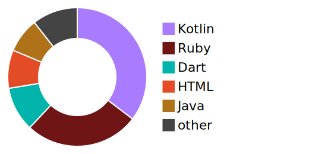

# Hi there👋, I am I am Eleo (a.k.a. EleoXDA and Elbay Malik)
  
---
## :information_desk_person:  About Me  :information_desk_person:
#### I am a mobile developer (kotlin, flutter,...swift). My journey started on XDA Developers Forum in 2012. I am advanced in QA and Junior in Android Development. I have edited several apps and have worked with custom ROM/firmware for several devices. Following that:

- I started with simple Bash & XML, and currently expanded my programming knowledge to Kotlin and Flutter. Expecting to receive Associate Android developer certificate from Google.
- I also am developing my Front-End side by joining full-time Le Wagon bootcamp on SQL, JavaScript and RubyOnRails.
- My next stop is learning Swift for iOS development.
- I’m looking to expand my collaborations on cross-platform and native mobile development

---

## :wrench:  Skills and Tools  :wrench:

These are the languages, frameworks and tools that I have been using:  

| | Proficient | Competent | Beginner |
| :-: | :-: | :-: | :-: |
| Languages | Kotlin | Bash, CSS, Dart, HTML, Ruby, SQL, XML | JavaScript, Java, Swift |
| Frameworks | | Flutter, Rails | Bootstrap, Tailwind, YAML |
| Tools | Android Studio, IntelliJ IDEA, VSCode | Visual Studio | XCode |
| Operating Systems | Windows | Linux | MacOS |
---

## :computer:  My GitHub Stats & Contributions  :computer:

  <a href="#">
    
    

  <a href="#">
    
    

  <a href="#">
  

