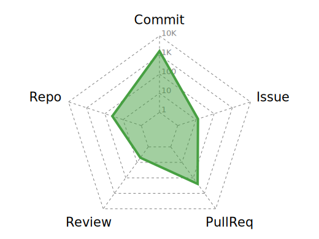
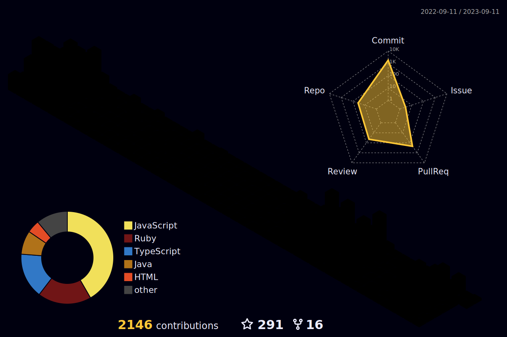

# **Hi there👋, I am EleoXDA (*a.k.a.* Elbay Malik)**
  
---
## :information_desk_person:  About Me
#### I am a junior mobile developer/fullstack web developer. My journey started on XDA Developers Forum in 2012. Following that:

- I started learning Bash and XML, whilst contributing to other developer's works.
- After that, I expanded my programming knowledge to Kotlin and Flutter.
- Recently, I became a certified FullStack Web developer - graduated from a full-time 9-week web development bootcamp (Le Wagon) learning Ruby, SQL, HTML, CSS, JS (and many others) with 2 Rails projects (https://www.devwork.team and https://www.socialize.tech) released at the end.
- My next stop is learning Swift for MacOS/iOS development to improve versatility of codes and cross-platform competency
- I’m looking to expand my collaborations on native and/or cross-platform development.
- Currently I freelance with projects ranging from android/cross-platform apps to Ruby(onRails)/JavaScript applets.

---

## :wrench:  Skills and Tools
<div align="center">
<table>
  <thead>
    <tr>
      <th colspan="7">Languages</th>
    </tr>
  </thead>
  <tr>
    <td>  </td><td>  </td><td>  </td><td>  </td><td>  </td><td>  </td><td>  </td></tr><tr><td>  </td><td>  </td><td>  </td><td>  </td><td>  </td><td>  </td><td>  </td>
  </tr>
 </table>

 <table>
    <thead>
    <tr>
      <th colspan="4">Frameworks</th>
      <th colspan="3">Agile Methodologies</th>
    </tr>
  </thead>
   <tr>
    <td> </td><td>  </td><td>  </td><td>  </td><td></td><td></td><td></td>
  </tr>
 </table>
 <table>
   <thead>
   <tr>
     <th colspan="7">Tools</th>
    </tr>
  </thead>
  <tr>
    <td> </td><td>  </td><td>  </td><td>  </td><td>  </td><td>  </td><td>  </td></tr><tr><td>  </td><td>  </td><td>  </td><td>  </td><td>  </td> <td>  </td> <td>  </td></tr><tr><td>  </td><td>  </td><td>  </td><td>  </td><td>  </td><td>  </td><td> 
    </td> 
  </tr>
</table>
 <table>
    <thead>
    <tr>
      <th colspan="7">Operating Systems</th>
    </tr>
  </thead>
   <tr>
    <td> </td><td>  </td><td>  </td><td>  </td><td>  </td><td>  </td><td>  </td>
  </tr>
 </table>
</div>

---

## :computer:  My GitHub Stats
<div align="center">
     <!--img height="180em" src="profile-3d-contrib/pie_lang_only.svg"-->
    
    
</div>
<div align="center">
    
    
</div>
<!--div align="center"-->
    <!--img height="220em" src="https://github-readme-stats.vercel.app/api/top-langs/?username=EleoXDA&langs_count=10&layout=compact&hide=c%2B%2B,CMake,C"-->
<!--/div-->
<div align="center">
    
</div>

## :abacus: Last 7 days of Language usage

<!--START_SECTION:waka-->

```text
From: 01 October 2022 - To: 08 October 2022

Total Time: 40 hrs 41 mins

JavaScript   12 hrs 37 mins  ⣿⣿⣿⣿⣿⣿⣿⣷⣀⣀⣀⣀⣀⣀⣀⣀⣀⣀⣀⣀⣀⣀⣀⣀⣀   31.02 %
Ruby         7 hrs 22 mins   ⣿⣿⣿⣿⣦⣀⣀⣀⣀⣀⣀⣀⣀⣀⣀⣀⣀⣀⣀⣀⣀⣀⣀⣀⣀   18.15 %
HTML         7 hrs 4 mins    ⣿⣿⣿⣿⣤⣀⣀⣀⣀⣀⣀⣀⣀⣀⣀⣀⣀⣀⣀⣀⣀⣀⣀⣀⣀   17.40 %
ERB          5 hrs 30 mins   ⣿⣿⣿⣤⣀⣀⣀⣀⣀⣀⣀⣀⣀⣀⣀⣀⣀⣀⣀⣀⣀⣀⣀⣀⣀   13.53 %
Markdown     4 hrs 38 mins   ⣿⣿⣷⣀⣀⣀⣀⣀⣀⣀⣀⣀⣀⣀⣀⣀⣀⣀⣀⣀⣀⣀⣀⣀⣀   11.43 %
XML          2 hrs 3 mins    ⣿⣤⣀⣀⣀⣀⣀⣀⣀⣀⣀⣀⣀⣀⣀⣀⣀⣀⣀⣀⣀⣀⣀⣀⣀   05.04 %
```

<!--END_SECTION:waka-->

## :abacus: Last 30 days of Contributions
<div align="center">
  
</div>

## :abacus: Last Year of Contributions
<div align="center">
  
</div>
