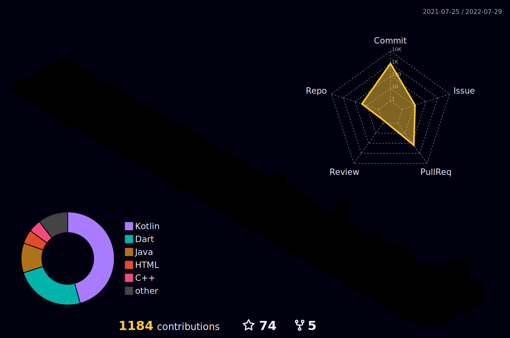

  
---
## :information_desk_person:  About Me  :information_desk_person:
#### Hello, I am Eleo (a.k.a. EleoXDA and Elbay Malik). My journey started on XDA Developers Forum in 2012. I am advanced in QA and Junior in Android Development. I have edited several apps and have worked with custom ROM/firmware for several devices.

- I know Bash and XML, and currently expanding my programming knowledge in Java and Kotlin for Android Studio, and Dart for Flutter.
- I am learning SQL, ECMAscript 6.0, RubyOnRails and etc on LeWagon Bootcamp
- My next stop is learning Swift for iOS development.
- I’m looking to collaborate on mobile developments like iOS and Android apps and MODs

---

## :wrench:  Skills and Tools  :wrench:

These are the technologies and tools that I have been using and/or learning:  

| | Proficient | Competent | Beginner |
| :-: | :-: | :-: | :-: |
| Programming Languages | Kotlin | Dart | Swift, Java |
| Frameworks | - | Flutter | React Native |
| Tools | Android Studio, VSCode, IntelliJ IDEA | - | - |
| Operating Systems | Windows, Linux | - | MacOS |

---

## :computer:  My GitHub Stats  :computer:

  <a href="https://github.com/EleoXDA">
  
  

  

  
  

