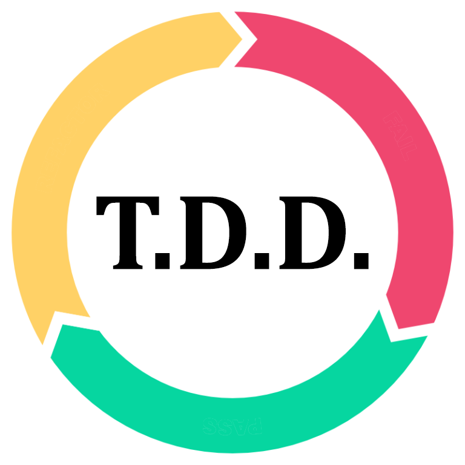

    

---

## :information_desk_person:  About Me
- I am a certified FullStack developer. Have experiences in both Mobile and Web development.
- Currently available for freelance and open-source projects.
- My programming experience is summarized in Table below.
- I’m looking to expand my workspace with new projects.
- Contact me through my <a href="mailto:elbay.malik@gmail.com">Email</a> address for further details.
---
## :wrench:  Skills and Tools

  <table>
    <thead>
      <tr>
        <th colspan="7">Languages & Frameworks</th>
      </tr>
    </thead>
    <tr>
     <td align="center" width=110>
     </td>
     <td align="center" width=110>
     </td>
     <td align="center" width=110>
     </td>
     <td align="center" width=110>
     </td>
     <td align="center" width=110>
     </td>
     <td align="center" width=110>'
     </td>
     <td align="center" width=110>
              </td>
    </tr>
    <tr>
     <td align="center" width=110>JavaScript</td>
     <td align="center" width=110>Typescript</td>
     <td align="center" width=110>React. JS</td>
     <td align="center" width=110>Next. JS</td>
     <td align="center" width=110>Vue. JS</td>
     <td align="center" width=110>Nuxt. JS</td>
     <td align="center" width=110>Node. JS</td>
    </tr>
    <tr>
     <td align="center" width=110>
     </td>
     <td align="center" width=110>
     </td>
     <td align="center" width=110>
     </td>
     <td align="center" width=110>
     </td>
     <td align="center" width=110>
     </td>
     <td align="center" width=110>
     </td>
     <td align="center" width=110>
     </td>
    </tr>
    <tr>
     <td align="center" width=110>Dart</td>
     <td align="center" width=110>Flutter</td>
     <td align="center" width=110>MySQL</td>
     <td align="center" width=110>PostgreSQL</td>
     <td align="center" width=110>Ruby</td>
      <td align="center" width=110>Rails</td>
      <td align="center" width=110>Kotlin</td>
    </tr>
  </table>
   <table>
     <thead>
      <tr>
       <th colspan="7">Tools</th>
      </tr>
     </thead>
     <tr>
      <td align="center" width=110>
      </td>
      <td align="center" width=110>
      </td>
      <td align="center" width=110>
      </td>
      <td align="center" width=110> 
      </td>
      <td align="center" width=110>
      </td>
      <td align="center" width=110>
     </td>
      <td align="center" width=110> 
      </td>
     </tr>
     <tr>
      <td align="center" width=110>WebPack</td>
      <td align="center" width=110>Heroku</td>
      <td align="center" width=110>Docker</td>
      <td align="center" width=110>Figma</td>
      <td align="center" width=110>Git</td>
      <td align="center" width=110>GitHub</td>
      <td align="center" width=110>GitLab</td>
     </tr>
     <tr>
       <td align="center" width=110>
      </td>
      <td align="center" width=110>
      </td>
      <td align="center" width=110>
      </td>
      <td align="center" width=110>
      </td>
      <td align="center" width=110>
      </td>
      <td align="center" width=110>
      </td>
      <td align="center" width=110>
      </td>
     </tr>
     <tr>
      <td align="center" width=110>Android Studio</td>
      <td align="center" width=110>IntelliJ</td>
      <td align="center" width=110>VSCode</td>
      <td align="center" width=110>Visual Studio</td>
      <td align="center" width=110>Yarn</td>
      <td align="center" width=110>Google Cloud</td>
      <td align="center" width=110>CodePen</td>
     </tr>
     <tr>
      <td align="center" width=110>
      </td>
      <td align="center" width=110>
      </td>
      <td align="center" width=110>
      </td>
      <td align="center" width=110>
      </td>
      <td align="center" width=110>
      </td>
      <td align="center" width=110>
      </td>
      <td align="center" width=110>
      </td>
     </tr>
     <tr>
      <td align="center" width=110>Gradle</td>
      <td align="center" width=110>Jenkins</td>
      <td align="center" width=110>JetBrains</td>
      <td align="center" width=110>T.D.D.</td>
      <td align="center" width=110>Scrum</td>
      <td align="center" width=110>Kanban</td>
      <td align="center" width=110>Jira</td>
     </tr>
  </table>
  <table>
    <thead>
      <tr>
        <th colspan="7">Operating Systems</th>
      </tr>
    </thead>
    <tr>
     <td align="center" width=110>
     </td>
     <td align="center" width=110>
     </td>
     <td align="center" width=110>
     
     <td align="center" width=110>
     </td>
     <td align="center" width=110>
     </td>
     <td align="center" width=110>
     </td>
     </td><td align="center" width=110>
     </td>
    </tr>
    <tr>
     <td align="center" width=110>Windows</td>
     <td align="center" width=110>Linux</td>
     <td align="center" width=110>MacOS</td>
     <td align="center" width=110>Android</td>
     <td align="center" width=110>iOS</td>
     <td align="center" width=110>Ubuntu</td>
     <td align="center" width=110>ChromeOS</td>
    </tr>
  </table>

---

## :computer:  My GitHub Stats

    <!--img height="180em" src="profile-3d-contrib/pie_lang_only.svg"-->
    <!--img height="200em" src="profile-3d-contrib/radar_contrib_only.svg"-->
    
    

    <!--img height="200em" src="https://github-profile-summary-cards.vercel.app/api/cards/most-commit-language?username=eleoxda"-->

<!--div align="center"-->
    <!--img height="220em" src="https://github-readme-stats.vercel.app/api/top-langs/?username=EleoXDA&langs_count=10&layout=compact&hide=c%2B%2B,CMake,C"-->
<!--/div-->

    
    

<!--## :abacus: Last 30 days of Contributions-->

  <!--img width="1000em" style="margin-top: 0px" src="https://eleo-readme-activity-graph.herokuapp.com/graph?username=EleoXDA&bg_color=ffffff&color=000000&line=4c9d9e&point=ff0000&area=true&hide_border=true&hide_title=true"-->

<!--## :abacus: Last Year of Contributions-->

  <!--img width="1000em" style="margin-top: 0px" src="./profile-3d-contrib/profile-custom-rainbow.svg"/-->

